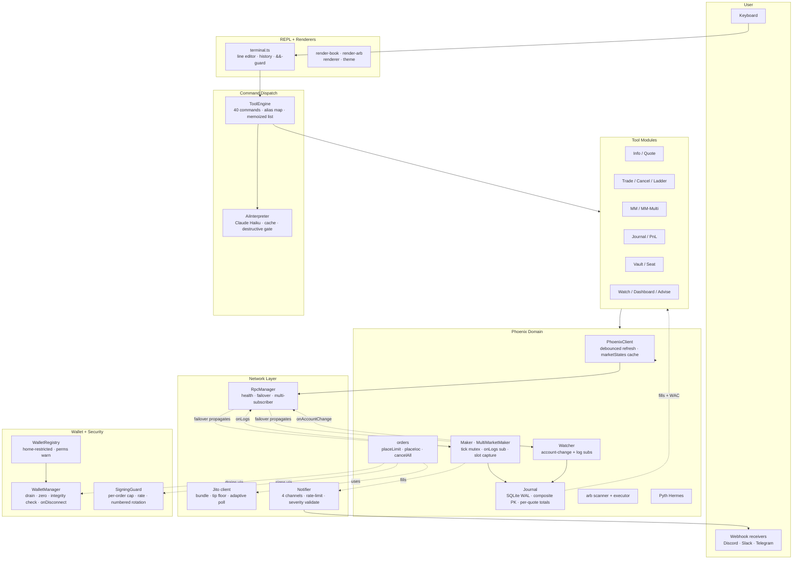

# Architecture

Phoenix Terminal is a single-process interactive trading terminal for the [Phoenix CLOB](https://github.com/Ellipsis-Labs/phoenix-v1) on Solana. This document covers the layers, the data flow for each major operation, and the invariants the system enforces.

If something here doesn't match the code, the code wins — file a bug.

---

## Layers



### What lives where (`src/`)

```
src/
├── index.ts                       Entry · uncaughtException + SIGTERM handlers
│
├── cli/
│   ├── terminal.ts                REPL · readline · history · graceful shutdown
│   ├── render-{book,arb}.ts       L2 + depth bars · arb cycle table
│   ├── renderer.ts                Tables · KV · AltScreenRenderer
│   └── theme.ts                   Phoenix-fire palette
│
├── tools/
│   ├── engine.ts                  Registry + dispatch + memoized list()
│   ├── tool-helpers.ts            AppCtx · flagNum · flagInt (NaN-safe)
│   ├── phoenix-tools.ts           Main registry; ~30 handlers + failover wiring
│   ├── tools-journal.ts           fills · pnl (per-quote-currency breakdown)
│   ├── tools-mm-multi.ts          mm-multi (cross-asset inventory)
│   └── tools-examples.ts          curated NL prompt cheatsheet
│
├── ai/
│   ├── interpreter.ts             Claude Haiku NL → command · prompt-cached
│   └── advisor.ts                 Live-state coaching · prompt-cached
│
├── phoenix/
│   ├── client.ts                  Lazy Phoenix.Client + debounced refresh
│   ├── markets.ts                 Canonical registry + O(1) findMarket
│   ├── orderbook.ts               L2 fetch with cumulative depth
│   ├── orders.ts                  Limit / IOC / cancel · seat-retry · Jito routing
│   ├── seats.ts                   Maker setup (ATA + claim) · cached
│   ├── vault.ts                   Deposit / withdraw / free-funds
│   ├── ladder-quote.ts            MultiplePostOnly · with-free-funds variant
│   ├── cancel-advanced.ts         ById / UpTo / Reduce
│   ├── eviction.ts                confirmOrCreateClaimSeat + findTraderToEvict
│   ├── routing.ts                 getExpectedOutAmountRouter + reverse
│   ├── market-info.ts             MarketStatus + PDAs + metadata
│   ├── oracle.ts                  Pyth Hermes reference + deviation
│   ├── watcher.ts                 Multi-market live · hotkey arming · failover-aware
│   ├── arb.ts                     Triangular cycle scanner + executor
│   ├── maker.ts                   Inventory-aware MM · canonical side detection
│   ├── multi-maker.ts             Cross-asset MM · asset-level inventory
│   ├── dashboard.ts               Full-screen control room
│   ├── backtest.ts                Passive sim against historical fills
│   ├── journal.ts                 SQLite WAL · composite PK · per-quote totals
│   └── fills.ts                   Live RPC fallback when journal empty
│
├── network/
│   ├── rpc-manager.ts             Health · slot-lag · multi-subscriber failover
│   ├── jito.ts                    Block-engine · tip floor · adaptive poll
│   └── notifier.ts                4 channels · token-bucket rate · severity validate
│
├── wallet/
│   ├── walletManager.ts           Drain · zero · integrity · onDisconnect cbs
│   └── wallet-registry.ts         Home-restricted discovery · perms warning
│
├── security/
│   └── signing-guard.ts           Per-order cap · rate · 4-gen log rotation
│
├── config/index.ts                Multi-location .env · validated RPC URL
├── types/index.ts                 Shared types
└── utils/
    ├── logger.ts                  11 secret-pattern families scrubbed
    ├── safe-env.ts                Typo-safe with one-shot warn
    ├── safe-number.ts             clamp · safeNumber · isFinite gates
    ├── retry.ts                   Exponential backoff
    ├── format.ts                  fmtUsd · fmtNum · pad
    └── explorer.ts                Solscan + Solana Explorer URLs
```

---

## Critical paths

### 1. Placing a trade

```
user                                 phoenix-terminal                              chain
─────                                ─────────────────                              ─────
type "buy 0.1 sol --ioc"
  └─→ REPL line handler
        └─→ engine.run('buy 0.1 sol --ioc')
              ├─→ tool.handler: placeOrderCmd
              │     ├─ flagInt(--ttl, 30)
              │     ├─ flagNum(--max-slippage)  ← throws if next is --flag
              │     ├─ if ctx.simulationMode: render paper-warn, return
              │     └─→ placeIoc(connection, signer, args)
              │           ├─ getMarket + refresh
              │           ├─ slippage check (router math)
              │           ├─ guard.checkOrderLimits(notional)
              │           ├─ guard.reserveSlot() — atomic rate-limit
              │           ├─ build ixs (ATA idem + swap)
              │           ├─ sendTx (wrapped in withSigning)
              │           │     ├─ wallet.beginSigning() ←┐
              │           │     ├─ sendAndConfirmTransaction       │ DRAIN GATE:
              │           │     └─ wallet.endSigning()  ←┘ disconnect() awaits
              │           ├─ parseFills (canonical SDK side)
              │           └─ guard.logAudit(result=confirmed, sig)
              └─→ render result
```

### 2. A fill arrives at the market maker

```
chain                       rpc-manager                  Maker
─────                       ───────────                  ─────
Phoenix program emits log
  └─ slot N
       └─→ ws.onLogs callback
             ├─ capture ctx.slot → lastObservedSlot
             └─→ handleProgramLog(sig)  (.catch wrapped)
                   ├─ getMarket once (cached)
                   ├─ getPhoenixEventsFromTransactionSignature
                   ├─ for each ix where header.market === ours:
                   │   for each FillEvent:
                   │     ├─ canonical side = sign(seqNum.fromTwos(64))
                   │     ├─ update stats (inv, vol, edge, count)
                   │     ├─ journal.insertFill(...,  sub_index++)
                   │     │     └─ composite PK (sig, sub_index) — multi-fill safe
                   │     └─ notifier.notify(...)  ← rate-limited
                   └─ render [mm fill] ticker line
```

### 3. RPC failover propagation

```
RpcManager health loop                                       active subscribers
─────────────────────                                        ──────────────────
every HEALTH_INTERVAL_MS:
  checkOne(active)
    ├─ slot lag > SLOT_LAG_THRESHOLD?
    └─ latency > LATENCY_THRESHOLD?
         └─→ failover(reason)
               ├─ checkAll → find healthy peer
               ├─ close prev._rpcWebSocket  ← no socket leak
               ├─ this._connection = createConnection(new)
               └─ for cb in onChangeCallbacks:
                    cb(newConn, newEp)
                      ├─→ wallet.setConnection(newConn)
                      ├─→ activeMaker.onConnectionChange(newConn)
                      │     ├─ subscribe NEW first
                      │     ├─ tear down OLD second
                      │     └─ zero-listener gap = 0ms
                      ├─→ activeMultiMaker.onConnectionChange(newConn)
                      └─→ activeWatcher.onConnectionChange(newConn)
```

### 4. Wallet switch / disconnect

```
user types "wallet use foo"             WalletManager                  Maker
───────────────────────────             ─────────────                  ─────
handler resolves "foo"
  └─→ ctx.wallet.disconnect()
        ├─ _disconnecting = true        (getKeypair returns null now)
        ├─ drainSigning(5s)             (waits for in-flight tx.sign)
        ├─ zeroCurrentSecret()          (fill sk Uint8Array with 0)
        ├─ keypair = null
        ├─ balancesCache = null
        └─ for cb in onDisconnect:
             cb()
               └─→ if (activeMaker) await activeMaker.stop()
                     ├─ cancelAll(...) ← BEFORE removeOnLogsListener
                     └─ remove sub
```

---

## Invariants (enforced; breakage = test failure)

| Invariant | Where | Test |
|---|---|---|
| Every signing path drains before disconnect | `withSigning()` wraps `sendTx`/`vault.send`/`ladder send`/`cancel-adv send` | `audit-fixes.test.ts` — disconnect resolves <200ms with counter==0 |
| Every new signing tool MUST be in DESTRUCTIVE_COMMANDS | `ai/interpreter.ts` exports the set | `ai-interpreter.test.ts` — cross-checks 20 known signers |
| Multi-fill same-tx writes don't collide | journal PK is `(signature, sub_index)` | `audit-fixes.test.ts` — 3 distinct sub_index rows persist |
| WAC PnL handles all 4 inventory transitions | `computeMarketPnl` branches per direction | 5 tests covering long→short, short→long, extend long/short, close-flat |
| Cross-market notional is segregated by quote symbol | `summary.totalsByQuote` | `audit-fixes.test.ts` — USDC + SOL produce distinct buckets |
| Maker fill-side detection uses Phoenix canon | `sign(toBN(seqNum).fromTwos(64))` in maker.ts, multi-maker.ts, watcher.ts, journal.ts | covered by `journal-pnl.test.ts` side branches |
| TTL is rebuilt on seat-retry (no stale order) | `orders.ts:placeLimit` retry path computes fresh `lastValidUnixTimestampInSeconds` | code-inspect; no synthetic test |
| Jito bundle send doesn't mutate caller's ix array | `sendBundleSimple` clones before push | `audit-fixes.test.ts` — tip-instruction min-lamports test exercises the path |
| ALERT_MIN_SEVERITY is validated | `notifier.ts` constructor | `audit-fixes.test.ts` (via safeEnvBool warn-on-typo pattern) |
| `arr[i]` access requires guard or assertion | `tsconfig.json: noUncheckedIndexedAccess: true` | every PR — tsc fails on unchecked access |
| Logger scrubs 11 secret pattern families | `SECRET_PATTERNS` array | `audit-fixes.test.ts` — Helius URL, GitHub PAT, AWS keys |
| Hotkey trades blocked in paper mode | `watcher.fireBid/fireAsk/fireCancelAll` check `isLiveMode()` thunk | code-inspect; deferred test (requires TTY) |
| Engine.list() returns stable identity until register | memoized `_listCache` | `audit-fixes.test.ts` — 2 dedicated tests |

---

## Memory bounds (prevents long-running leaks)

| Resource | Bound | Cleanup trigger |
|---|---|---|
| AI translation cache | 50 entries · 16KB/entry · 1KB key | LRU eviction on insert, TTL 10min |
| Tool engine list cache | 1 array per registered set | invalidated on `register()` |
| Notifier per-channel-kind map | 200 entries | GC when crossed, prunes >1h old |
| Notifier sent-times array | 60s rolling window | filtered on each `allow()` |
| Signing audit log | 10 MB × 4 generations | numbered rotation on write |
| Wallet balances cache | 1 entry · 30s TTL | invalidated on wallet replace |
| Phoenix client market refresh | per-market 400ms debounce | timestamp-keyed |
| Pyth oracle cache | 4s TTL | per-symbol map |
| Tip floor cache | 15s TTL | single entry |
| RPC slot history | one entry per endpoint | bounded by endpoint count |

---

## Safety posture — what's protected, what isn't

### Protected

- **Secret-key bytes never leak past disconnect** — `withSigning()` drain gate + `zeroCurrentSecret()` + half-corruption-aware `verifyKeypairIntegrity()`.
- **Every signing operation passes the SigningGuard** — per-order notional cap + rate limit + numbered audit log.
- **Every signing operation runs inside the active wallet's signing window** — concurrent `disconnect()` blocks for up to 5s.
- **AI prompts can never silently fire a destructive command** — `DESTRUCTIVE_COMMANDS` forces explicit re-run; low-confidence also forces re-run.
- **Watcher hotkeys ignore `mode paper`** — `isLiveMode()` thunk evaluated at fire-time.
- **REPL `&&` chains containing destructive segments are refused** — one-line `mode live && buy ...` rejected.
- **Log files scrub 11 secret pattern families** — Anthropic/OpenAI/GitHub/AWS/Helius URLs/etc.
- **Wallet path traversal blocked at the registry AND the manager** — both reject paths outside `$HOME`.
- **Group/world-readable wallet files warn loudly** — `wallets list` flags `chmod 644` files.
- **SIGTERM / SIGHUP run the full graceful shutdown** — journal close, secret zero, orders cancelled.
- **TypeScript blocks unchecked array access at compile time** — `noUncheckedIndexedAccess`.
- **Unhandled async rejections can't crash the WS log listener** — explicit `.catch` on `handleProgramLog`.

### NOT protected (operator responsibility)

- **RPC endpoint integrity** — a malicious RPC can serve fake account data. Use trusted endpoints (Helius/Triton/QuickNode with auth).
- **Transitive CVEs with no upstream fix** — `bigint-buffer` GHSA-3gc7-fjrx-p6mg comes via `@solana/spl-token`; no patched version exists. See [SECURITY.md](./SECURITY.md).
- **Jito public endpoint reliability** — free tier is best-effort. Use a paid Jito-proxy provider for production MM.
- **Slippage on extremely thin markets** — `arb --execute` and `mm` on a market with <$1k of depth can hit unexpected impact even with `--max-slippage`. The pre-trade router math is accurate, but a market that thins between quote and fill can move past the slippage band.

---

## Why these decisions

- **SQLite journal vs in-memory:** Restarting the bot is common during a session; losing all PnL on Ctrl-C breaks trust. WAL mode + composite PK makes the journal a durable source of truth that's faster than re-walking chain history.
- **`onLogs` for fill detection vs polling:** Subscriptions are push-based; polling at <1s intervals would 429 most RPC endpoints. The handler captures `ctx.slot` for the journal so we don't lose the slot dimension.
- **Per-quote-currency PnL totals vs global USD sum:** SOL-quoted markets store quote-as-SOL notional; summing across USDC + SOL would produce dollar-suffixed nonsense. Segregating preserves accuracy without requiring oracle conversion.
- **Canonical side detection via `sign(seqNum.fromTwos(64))`:** Phoenix's bid orders use twos-complement-negated sequence numbers; the SDK's `fillListener.ts` example documents this. Heuristics like price-vs-mid mis-attributed fills inside the spread.
- **NaN-safe `flagNum` helper:** `--max-slippage --use-jito` (operator typo) silently produced NaN → slippage check skipped because `NaN > 0` is false. The helper throws when the next token is a flag or missing, surfacing the typo at parse time.
- **`withSigning()` global wrapper:** Wallet manager has no direct reference to every signer; the global registry lets `disconnect()` know if anyone is mid-tx without each call site holding a wallet ref.
- **noUncheckedIndexedAccess:** Forces every `arr[i]` to be typed as `T | undefined`. Catches off-by-one bugs at compile time. The runtime cost is zero — it's a type-system change.

---

## See also

- [SECURITY.md](./SECURITY.md) — threat model, disclosure, known CVEs.
- [README.md](./README.md) — quick start + command reference.
- [Phoenix SDK examples](https://github.com/Ellipsis-Labs/phoenix-sdk/tree/master/examples) — canonical patterns this terminal is built on.
