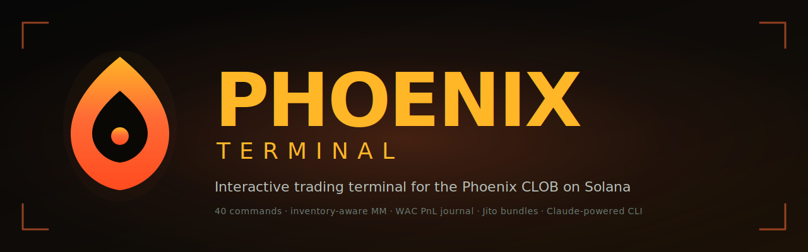

<div align="center">



**The first interactive trading terminal for the [Phoenix CLOB](https://github.com/Ellipsis-Labs/phoenix-v1) on Solana.**

[](https://github.com/Abdr007/phoenix-terminal/actions/workflows/ci.yml)
[](https://opensource.org/licenses/MIT)
[](https://nodejs.org)
[](https://github.com/Ellipsis-Labs/phoenix-sdk)
[](https://www.anthropic.com)

</div>

---

Phoenix has no first-party TUI. **This is one.** Type plain English (`whats my pnl`, `buy 1 sol via jito`, `start mm on sol/usdc with 5bps spread`) — Claude translates it to a typed command and runs it. Or skip the AI and use the 40 commands directly.

```
phoenix › what should i do
› AI → advise  [high]  (User asked for general analysis)

  AI ADVISOR
  ──────────────────────────────────────────────────
  ## Read
  You've made 2 micro-fills on SOL/USDC with zero PnL; wallet holds ~$48 USDC
  + 0.11 JitoSOL, but no active MM or positions to defend.

  ## Risks
  🔴 JitoSOL/USDC market is broken — 11,325 bps spread, Phoenix mid massively
     above Pyth. Liquidity desert. Avoid.
  🟡 SOL/USDC spread is wide (369 bps) — suggests thin MM. Your 0.011 SOL
     inventory from earlier fills is unhedged.

  ## Recommended next actions
  1. mm start SOL/USDC --size 0.05 --half 50 --oracle-anchor
  2. Monitor 10 min; if filling too thin, tighten with --half 75
```

## Quick start

```bash
git clone <repo> && cd phoenix-terminal
npm install
cp .env.example .env       # set RPC_URL + ANTHROPIC_API_KEY
npm run build
npm link                   # exposes `phoenix`, `pterm`, `phoenix-terminal` globally
phoenix                    # launch
```

Inside the terminal, just type — natural language is auto-translated:
```
phoenix › whats my pnl
phoenix › buy 1 sol but cap slippage at 30bps
phoenix › make markets on sol/usdc with 5bps spread size 0.05
```

## Commands

| Group | Commands |
|---|---|
| **Market data** | `markets`, `book`, `l3`, `mid`, `market-info`, `oracle` |
| **Pre-trade math** | `quote`, `quote-out` (uses SDK router for expected fill + price impact) |
| **Live monitoring** | `watch` (full-screen multi-market + fill ticker), `arb` (triangular scanner) |
| **Execution** | `buy`, `sell` (with `--ioc --max-slippage BPS`), `orders`, `cancel` |
| **Surgical** | `cancel-id`, `cancel-top`, `reduce` (all support `--use-free`) |
| **Vault / seat** | `deposit`, `withdraw`, `free-funds`, `claim-seat`, `evict-check` |
| **Market making** | `mm start/stop/status`, `ladder` (multi-level post-only via `createPlaceMultiplePostOnlyOrders`) |
| **PnL & history** | `pnl` (realized + per-market WAC), `fills` (instant from SQLite journal) |
| **AI / discovery** | `ai <prompt>`, `examples`, `help` |
| **System** | `wallet`, `mode`, `rpc`, `config`, `jito`, `quit` |

Run `examples` inside the terminal for a curated advanced-prompt cheatsheet.

## Killer features

### Persistent PnL journal
SQLite at `~/.phoenix/journal.db`. First `pnl --sync` walks chain backwards, indexes every Phoenix fill, attributes maker/taker by `orderSequenceNumber` side encoding, computes weighted-average-cost realized PnL per market. Subsequent reads are <1ms.

### Live MM telemetry
`mm status` shows real-time:
- Total fills (split bid/ask), fill rate (`fills/places`)
- Dollar volume + per-hour extrapolation
- **Realized edge captured** = Σ |fill_price − mid_at_fill| × size — your actual maker rebate equivalent
- Inventory + mark-to-mid USD value
- Last fill (time, side, price)

Powered by `connection.onLogs(PROGRAM_ID)` subscription; every fill streams as `[mm fill] ● BUY 0.05 inv $0.0023 edge 12 fills`.

### Inventory-aware MM (Avellaneda-Stoikov-lite)
- Reservation price r = mid × (1 − γσ²q̂) where q̂ is normalized inventory
- Asymmetric half-spread that widens on the side that would worsen inventory
- Hard inventory cap, mid-jump sanity check, TTL-bounded post-only orders
- Cancel + bid + ask sequenced with 250ms spacing to respect signing-guard rate limits

### Triangular arb scanner
Across the SOL ↔ USDC ↔ USDT ↔ JitoSOL graph: builds every 3-cycle, computes round-trip return from top-of-book, sorts by profit bps. Currently view-only — `--execute` flag planned.

### Optional Jito bundles
Add `--use-jito` to any execution command for guaranteed-block inclusion via Jito's block engine. Tip is auto-added (default 10000 lamports or 50th-percentile floor). `jito` command shows current tip floor by percentile.

> **Caveat — free public endpoint is best-effort.** The default `mainnet.block-engine.jito.wtf` accepts bundles (you'll get a bundle ID), but landing is **not guaranteed**: bundles can be silently dropped during congestion, and the rate limiter on the polling endpoint is aggressive (HTTP 429 on rapid retries). Live-verified behavior:
> - Tip 10,000 lamports → bundle accepted, didn't land within 30s
> - Polling for status returned empty (bundle expired from Jito's view)
> - Same trade via the normal RPC path filled cleanly in ~3s
>
> **For production MM**, use one of:
> - A paid Jito-proxy provider (Helius, QuickNode, Triton all offer this) — set `JITO_BLOCK_ENGINE_URL=https://<your-endpoint>` in `.env`
> - Higher tips at the 95th–99th percentile (run `jito` to see current floor)
> - The non-Jito path (the default) — much more reliable on the free tier
>
> Use `--use-jito` strategically: during obvious congestion windows, or when atomic multi-tx execution truly matters. For routine trades, the standard path is faster and more reliable.

### Natural-language translator (Claude Haiku 4.5)
- Cold start: ~1.8s (one prewarm fires on init)
- Cache hit: 0ms
- Steady state: 1.4–2s per translation
- Cost: ~$0.003 per call
- Tested against 41 prompts across 9 categories: 100% mapped to valid commands

## Configuration

All via `.env` (see `.env.example`). Highlights:
- `SIMULATION_MODE=true/false` — also runtime-togglable via `mode` command
- `MAX_NOTIONAL_PER_ORDER`, `MAX_ORDERS_PER_MINUTE`, `MIN_DELAY_BETWEEN_ORDERS_MS` — signing guards
- `ANTHROPIC_API_KEY` — enables the AI translator (optional)

Config is loaded from: `$PHOENIX_ENV` → `./.env` → `~/.phoenix/.env` → `.env` next to the binary. Works from any directory.

## Architecture

```
src/
├── ai/interpreter.ts           Claude Haiku NL → command, with prewarm + LRU cache
├── cli/
│   ├── terminal.ts             REPL, banner, history file
│   ├── render-book.ts          L2 + depth bars
│   ├── render-arb.ts           Arb cycle table
│   ├── renderer.ts             Tables, KV, separators, AltScreenRenderer
│   └── theme.ts                Phoenix-fire palette
├── config/index.ts             Multi-location env loader, RPC URL validation
├── network/
│   ├── rpc-manager.ts          Failover, health, slot-lag detection
│   └── jito.ts                 Block-engine client, tip rotation, tip floor
├── wallet/
│   ├── walletManager.ts        Keypair safety, balances
│   └── wallet-registry.ts      Auto-discover keypairs by name
├── security/signing-guard.ts   Per-order notional cap, rate limiter, audit log
├── phoenix/
│   ├── client.ts               Lazy Phoenix.Client with debounced refresh
│   ├── markets.ts              Canonical registry with liquidity tiers
│   ├── orderbook.ts            L2 fetch with cumulative depth
│   ├── orders.ts               Limit / IOC / cancel, seat retry, Jito routing
│   ├── seats.ts                Maker setup (ATA + claim) with cache
│   ├── vault.ts                Deposit / withdraw / free-funds
│   ├── ladder-quote.ts         MultiplePostOnly (with --use-free)
│   ├── cancel-advanced.ts      ById / UpTo / Reduce (with --use-free)
│   ├── eviction.ts             confirmOrCreate + findTraderToEvict
│   ├── routing.ts              getExpectedOutAmountRouter + reverse
│   ├── market-info.ts          MarketStatus enum + PDAs + metadata
│   ├── oracle.ts               Pyth Hermes reference + Phoenix deviation
│   ├── watcher.ts              Multi-market dashboard + log-sub fill ticker
│   ├── arb.ts                  Triangular cycle scanner
│   ├── maker.ts                Inventory-aware MM with live telemetry
│   ├── journal.ts              SQLite fill journal + WAC PnL engine
│   └── fills.ts                Live RPC fallback when journal empty
├── tools/
│   ├── engine.ts               Command registry + dispatch
│   └── phoenix-tools.ts        All 34 command handlers
├── types/index.ts
├── utils/
│   ├── logger.ts, retry.ts, safe-env.ts, safe-number.ts, format.ts
│   └── explorer.ts             Solscan / Solana Explorer link builders
└── index.ts
```

## Safety

- `SIMULATION_MODE=true` is default — no on-chain action until explicitly flipped
- Every signing path passes through `SigningGuard`: per-order notional cap + rate limiter + JSONL audit log at `~/.phoenix/signing-audit.log`
- Keypair secret bytes zeroed on `disconnect` and on session timeout (15 min idle)
- RPC URL + wallet path validated to prevent credential leakage / traversal
- Pre-trade slippage guard rejects IOC orders predicted to exceed `--max-slippage`

## Status

Phoenix Legacy spot only. Phoenix Perpetuals (private beta, Dec 2025) is a separate SDK — not wired here.

## License

MIT
